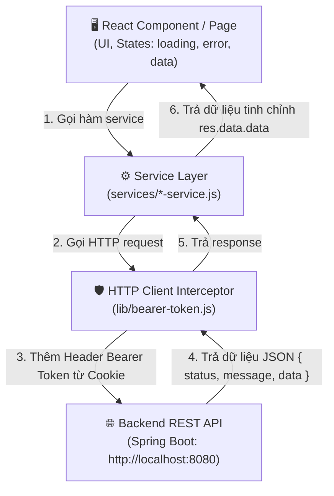

# 📘 Quy Trình Step-by-Step Fetch & Quản Lý API (Dành cho Admin)

Tài liệu này cung cấp quy trình từng bước (Step-by-step) chuẩn hóa để kết nối, quản lý và sử dụng API trong ứng dụng **Admin (Next.js / React)**.

---

## 🎯 1. Tổng Quan Kiến Trúc Quản Lý API

Dự án tuân theo kiến trúc **Mô Hình 3 Tầng (Layered Architecture)** để tách biệt giao diện UI và logic gọi API:



### ✅ Lợi ích của kiến trúc này:
1. **Dễ bảo trì:** Khi Backend đổi URL Endpoint, bạn chỉ cần sửa ở 1 nơi (`services/`).
2. **Tự động hóa Auth:** Không cần thủ công thêm `Authorization Header` ở mỗi lệnh fetch.
3. **Quản lý state chuẩn:** Giúp giao diện mượt mà với đầy đủ trạng thái `loading`, `error`, `success`.

---

## 🚀 2. Quy Trình 5 Bước Chuẩn Để Fetch & Quản Lý API

---

### 🔹 BƯỚC 1: Cấu Hình Quản Lý HTTP Client Trung Tâm (`lib/bearer-token.js`)

Mọi Yêu cầu HTTP đều đi qua `tokenBearer` (Axios Instance). File này có nhiệm vụ:
- Định nghĩa `baseURL` thống nhất (vd: `http://localhost:8080`).
- Tự động lấy JWT `access_token` từ **Cookie** và gắn vào Header `Authorization: Bearer <token>`.
- Bỏ qua đính kèm token đối với các route Auth public (`/auth/sign-in`, `/auth/admin/sign-in`).

```javascript
// lib/bearer-token.js
import axios from "axios";

const tokenBearer = axios.create({
  baseURL: "http://localhost:8080",
});

tokenBearer.interceptors.request.use((config) => {
  // Không gắn token cho route đăng nhập
  if (config.url && (config.url.includes("/auth/sign-in") || config.url.includes("/auth/admin/sign-in"))) {
    return config;
  }

  // Đọc access_token từ Cookie trình duyệt
  const token = document.cookie
    .split(';')
    .find(row => row.trim().startsWith('access_token='))
    ?.trim()
    ?.split('=')[1];

  if (token) {
    config.headers.Authorization = `Bearer ${token}`;
  }

  return config;
});

export default tokenBearer;
```

---

### 🔹 BƯỚC 2: Định Nghĩa API Service Trong Thư Mục `services/`

Mỗi đối tượng dữ liệu (Tour, User, Booking, Category...) sở hữu 1 file service riêng trong `services/`.

#### Quy chuẩn viết Service CRUD:
```javascript
// services/product-service.js
import tokenBearer from "@/lib/bearer-token";

const baseURL = "http://localhost:8080";

const productService = {
  // 1. Lấy danh sách (GET ALL)
  async getAllProducts() {
    try {
      const res = await tokenBearer.get(`${baseURL}/products`);
      // Trả về phần dữ liệu chính từ envelope { status, message, data }
      return res.data.data;
    } catch (error) {
      const message = error.response?.data?.message || "Lỗi khi lấy danh sách sản phẩm";
      throw new Error(message);
    }
  },

  // 2. Lấy thông tin theo ID (GET BY ID)
  async getProductById(id) {
    try {
      const res = await tokenBearer.get(`${baseURL}/products/${id}`);
      return res.data.data;
    } catch (error) {
      const message = error.response?.data?.message || "Không tìm thấy sản phẩm";
      throw new Error(message);
    }
  },

  // 3. Tạo mới (POST)
  async createProduct(data) {
    try {
      const res = await tokenBearer.post(`${baseURL}/products`, data);
      return res.data.data;
    } catch (error) {
      const message = error.response?.data?.message || "Tạo sản phẩm thất bại";
      throw new Error(message);
    }
  },

  // 4. Cập nhật (PUT / PATCH)
  async updateProduct(id, data) {
    try {
      const res = await tokenBearer.patch(`${baseURL}/products/${id}`, data);
      return res.data.data;
    } catch (error) {
      const message = error.response?.data?.message || "Cập nhật sản phẩm thất bại";
      throw new Error(message);
    }
  },

  // 5. Xóa (DELETE)
  async deleteProduct(id) {
    try {
      const res = await tokenBearer.delete(`${baseURL}/products/${id}`);
      return res.data.data;
    } catch (error) {
      const message = error.response?.data?.message || "Xóa sản phẩm thất bại";
      throw new Error(message);
    }
  }
};

export default productService;
```

---

### 🔹 BƯỚC 3: Gọi API & Quản Lý State Trên Giao Diện (React Component)

Trong React Client Component (`"use client"`), luôn quản lý **3 trạng thái nền tảng**:
1. `data`: Dữ liệu nhận từ API.
2. `loading`: Trạng thái đang tải (`true`/`false`).
3. `error`: Thông báo lỗi nếu có.

#### Mẫu Fetch Dữ Liệu Khi Mount (`useEffect`):
```tsx
"use client";

import { useState, useEffect } from "react";
import productService from "@/services/product-service";

export default function ProductListPage() {
  const [products, setProducts] = useState<any[]>([]);
  const [loading, setLoading] = useState<boolean>(true);
  const [error, setError] = useState<string | null>(null);

  useEffect(() => {
    async function loadData() {
      try {
        setLoading(true);
        setError(null);
        const data = await productService.getAllProducts();
        setProducts(data);
      } catch (err: any) {
        setError(err.message || "Không thể tải danh sách sản phẩm");
      } finally {
        setLoading(false);
      }
    }

    loadData();
  }, []);

  if (loading) return <div className="p-4 text-center">⏳ Đang tải dữ liệu...</div>;
  if (error) return <div className="p-4 text-red-500">❌ Lỗi: {error}</div>;

  return (
    <div className="p-6">
      <h1 className="text-2xl font-bold mb-4">Danh Sách Sản Phẩm</h1>
      <ul className="space-y-2">
        {products.map((item) => (
          <li key={item.id} className="p-3 border rounded shadow-sm">
            <span className="font-semibold">{item.name}</span> - {item.price?.toLocaleString()} VNĐ
          </li>
        ))}
      </ul>
    </div>
  );
}
```

#### Mẫu Gửi Dữ Liệu (Submit Form):
```tsx
const handleSubmit = async (e: React.FormEvent) => {
  e.preventDefault();
  setSubmitting(true);
  setError(null);

  try {
    const newProduct = await productService.createProduct({
      name: formData.name,
      price: Number(formData.price),
    });
    alert("Thêm sản phẩm thành công!");
    // Refresh danh sách hoặc redirect trang
  } catch (err: any) {
    setError(err.message || "Tạo thất bại");
  } finally {
    setSubmitting(false);
  }
};
```

---

### 🔹 BƯỚC 4: Tối Ưu Hóa & Quản Lý Nâng Cao

#### 1. Gọi Nhiều API Song Song Nhanh Nhất (`Promise.all`)
Tránh tình trạng "Waterfall Fetch" (gọi nối tiếp từng API làm chậm trang). Hãy dùng `Promise.all`:

```tsx
useEffect(() => {
  async function fetchInitialData() {
    try {
      setLoading(true);
      const [categories, destinations, transports] = await Promise.all([
        categoryService.getAllCategories(),
        destinationService.getAllDestinations(),
        transportService.getAllTransports(),
      ]);

      setCategories(categories);
      setDestinations(destinations);
      setTransports(transports);
    } catch (err: any) {
      setError("Lỗi tải dữ liệu khởi tạo");
    } finally {
      setLoading(false);
    }
  }

  fetchInitialData();
}, []);
```

#### 2. Lọc Dữ Liệu Theo Query Parameters (Filter & Pagination)
Truyền Query Params từ UI sang Service:

```javascript
// Trong service
async getToursWithFilter(params) {
  // params: { page: 1, limit: 10, search: "Hà Nội" }
  const res = await tokenBearer.get(`${baseURL}/tours`, { params });
  return res.data.data;
}
```

---

### 🔹 BƯỚC 5: Kiểm Tra Lỗi & Debugging Checklist

Khi API không hoạt động như mong đợi, thực hiện kiểm tra theo thứ tự:

| Bước | Hành Động Kiểm Tra | Công Cụ / Cách Thực Hiện |
| :--- | :--- | :--- |
| **1** | Kiểm tra Network tab | Mở DevTools (F12) ➔ Sang tab **Network** ➔ Lọc theo **Fetch/XHR** ➔ Xem Request URL & Status Code. |
| **2** | Kiểm tra Bearer Token | Kiểm tra Header `Authorization` có chứa `Bearer eyJ...` không. Nếu không, kiểm tra xem đã Đăng nhập và Cookie `access_token` có tồn tại chưa. |
| **3** | Kiểm tra Payload Gửi Đi | Kiểm tra tab **Payload** hoặc **Headers** xem Body JSON gửi lên Backend đã đúng định dạng DTO chưa. |
| **4** | Kiểm tra Response Trả Về | Kiểm tra tab **Response** để xem Backend trả về mã lỗi gì (`message` hoặc `errors`). |
| **5** | Khắc phục lỗi CORS | Nếu gặp lỗi CORS policy, kiểm tra xem Backend Spring Boot đã bật `@CrossOrigin` hoặc Cấu hình CORS Filter cho `http://localhost:3000` chưa. |

---

## 📋 Checklist Tóm Tắt Khi Tạo Feature API Mới

- [ ] 1. Kiểm tra API Endpoint trên Postman / Swagger backend.
- [ ] 2. Định nghĩa/cập nhật hàm trong file `services/[feature]-service.js`.
- [ ] 3. Import service vào React Component (`"use client"`).
- [ ] 4. Khai báo 3 states: `data`, `loading`, `error`.
- [ ] 5. Bọc lệnh gọi service trong `try...catch...finally`.
- [ ] 6. Hiển thị UI tương ứng cho trạng thái `Loading`, `Error` và `Success`.
