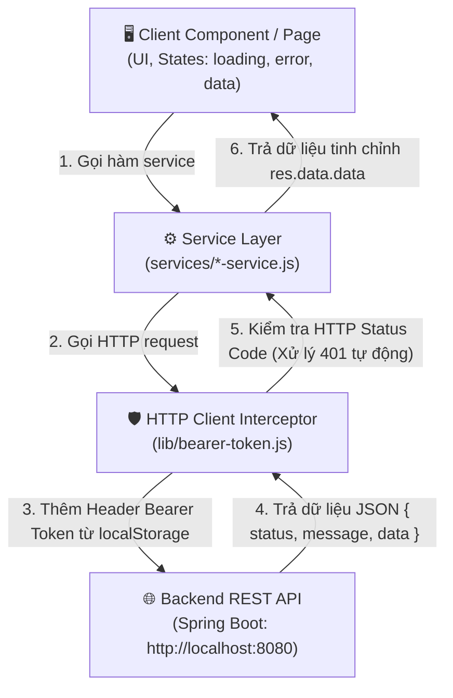

# 📘 Quy Trình Step-by-Step Fetch & Quản Lý API (Dành cho Client)

Tài liệu này cung cấp quy trình từng bước (Step-by-step) chuẩn hóa để kết nối, quản lý và sử dụng API trong ứng dụng **Client (Next.js / React)** dành cho người dùng cuối.

---

## 🎯 1. Tổng Quan Kiến Trúc Quản Lý API

Ứng dụng Client tuân theo kiến trúc **Mô Hình 3 Tầng (Layered Architecture)** để tách biệt giao diện UI và logic tương tác dữ liệu:



### ✅ Lợi ích của kiến trúc này:
1. **Dễ duy trì & mở rộng:** Khi đường dẫn API của Backend thay đổi, chỉ cần cập nhật ở file service tương ứng.
2. **Tự động hóa Xác Thực & Đăng Xuất:** `lib/bearer-token.js` tự lấy token từ `localStorage` và tự làm sạch storage khi Token hết hạn (Lỗi HTTP 401).
3. **Trải nghiệm người dùng tốt:** Đảm bảo UI luôn thể hiện rõ trạng thái Đang tải (`loading`), Thất bại (`error`), và Thành công (`data`).

---

## 🚀 2. Quy Trình 5 Bước Chuẩn Để Fetch & Quản Lý API

---

### 🔹 BƯỚC 1: Cấu Hình Quản Lý HTTP Client Trung Tâm (`lib/bearer-token.js`)

Tất cả request trong ứng dụng Client đều dùng `tokenBearer` (Axios Instance). File này thực hiện các tác vụ:
- Định nghĩa `baseURL` mặc định (`http://localhost:8080`).
- Tự động kiểm tra `localStorage` phía client (`typeof window !== "undefined"`), lấy `token` đính kèm vào Header `Authorization: Bearer <token>`.
- Xử lý Response Interceptor: Tự động xóa `token` khỏi `localStorage` nếu Server trả về lỗi 401 Unauthenticated.

```javascript
// lib/bearer-token.js
import axios from "axios";

const tokenBearer = axios.create({
  baseURL: "http://localhost:8080",
});

// 1. Request Interceptor: Gắn Token
tokenBearer.interceptors.request.use((config) => {
  if (typeof window !== "undefined") {
    const token = localStorage.getItem("token");
    if (token) {
      config.headers.Authorization = `Bearer ${token}`;
    }
  }
  return config;
});

// 2. Response Interceptor: Xử lý 401
tokenBearer.interceptors.response.use(
  (response) => response,
  (error) => {
    if (error.response && error.response.status === 401) {
      if (typeof window !== "undefined") {
        localStorage.removeItem("token");
      }
    }
    return Promise.reject(error);
  }
);

export default tokenBearer;
```

---

### 🔹 BƯỚC 2: Định Nghĩa API Service Trong Thư Mục `services/`

Mỗi module dữ liệu của Client (Tour, Booking, Review, Auth, User, Payment...) được quản lý bởi một file service riêng trong `services/`.

#### Quy chuẩn viết Service CRUD:
```javascript
// services/tour-service.js
import tokenBearer from "@/lib/bearer-token";

const baseURL = "http://localhost:8080";

const tourService = {
  // 1. Lấy danh sách Tour (GET ALL)
  async getAllTours() {
    try {
      const res = await tokenBearer.get(`${baseURL}/tours`);
      // Bóc tách envelope từ Spring Boot { status, message, data }
      return res.data.data;
    } catch (error) {
      const message = error.response?.data?.message || "Lỗi khi tải danh sách tour";
      throw new Error(message);
    }
  },

  // 2. Lấy chi tiết Tour theo ID (GET BY ID)
  async getTourById(id) {
    try {
      const res = await tokenBearer.get(`${baseURL}/tours/${id}`);
      return res.data.data;
    } catch (error) {
      const message = error.response?.data?.message || "Không tìm thấy thông tin tour";
      throw new Error(message);
    }
  },

  // 3. Đặt Tour mới (POST)
  async createBooking(bookingData) {
    try {
      const res = await tokenBearer.post(`${baseURL}/bookings`, bookingData);
      return res.data.data;
    } catch (error) {
      const message = error.response?.data?.message || "Đặt tour không thành công";
      throw new Error(message);
    }
  },

  // 4. Gửi Đánh giá / Review (POST)
  async postReview(reviewData) {
    try {
      const res = await tokenBearer.post(`${baseURL}/reviews`, reviewData);
      return res.data.data;
    } catch (error) {
      const message = error.response?.data?.message || "Gửi đánh giá thất bại";
      throw new Error(message);
    }
  }
};

export default tourService;
```

---

### 🔹 BƯỚC 3: Gọi API & Quản Lý State Trên Giao Diện (React Component)

Trên giao diện Client Component (`"use client"`), luôn luôn quản lý **3 trạng thái chuẩn**:
1. `data`: Dữ liệu nhận từ API.
2. `loading`: Trạng thái đang tải dữ liệu.
3. `error`: Thông báo lỗi phát sinh.

#### Mẫu Fetch Dữ Liệu Khi Mount (`useEffect`):
```tsx
"use client";

import { useState, useEffect } from "react";
import tourService from "@/services/tour-service";

export default function FeaturedToursPage() {
  const [tours, setTours] = useState<any[]>([]);
  const [loading, setLoading] = useState<boolean>(true);
  const [error, setError] = useState<string | null>(null);

  useEffect(() => {
    async function loadData() {
      try {
        setLoading(true);
        setError(null);
        const data = await tourService.getAllTours();
        setTours(data);
      } catch (err: any) {
        setError(err.message || "Không thể tải danh sách tour");
      } finally {
        setLoading(false);
      }
    }

    loadData();
  }, []);

  if (loading) return <div className="p-4 text-center">⏳ Đang tải tour du lịch...</div>;
  if (error) return <div className="p-4 text-red-500 text-center">❌ {error}</div>;

  return (
    <div className="container mx-auto p-4">
      <h1 className="text-2xl font-bold mb-6">Tour Du Lịch Nổi Bật</h1>
      <div className="grid grid-cols-1 md:grid-cols-3 gap-6">
        {tours.map((tour) => (
          <div key={tour.id} className="border rounded-lg p-4 shadow-md hover:shadow-lg transition">
            <h3 className="text-xl font-semibold mb-2">{tour.name}</h3>
            <p className="text-gray-600 mb-2">{tour.description}</p>
            <div className="text-blue-600 font-bold">{tour.price?.toLocaleString()} VNĐ</div>
          </div>
        ))}
      </div>
    </div>
  );
}
```

#### Mẫu Thực Hiện Đặt Tour (POST Booking):
```tsx
const handleBooking = async () => {
  setSubmitting(true);
  setError(null);

  try {
    const result = await bookingService.createBooking({
      tourId: tour.id,
      numberOfPeople: guests,
      bookingDate: selectedDate,
    });
    alert("Đặt tour thành công! Mã đơn của bạn là: " + result.id);
  } catch (err: any) {
    setError(err.message || "Đặt tour thất bại, vui lòng thử lại.");
  } finally {
    setSubmitting(false);
  }
};
```

---

### 🔹 BƯỚC 4: Tối Ưu Hóa Trải Nghiệm Khách Hàng (Advanced Client Patterns)

#### 1. Lấy Dữ Liệu Song Song Bằng `Promise.all`
Khi trang chi tiết tour cần tải đồng thời thông tin tour, danh sách đánh giá và tour tương tự:

```tsx
useEffect(() => {
  async function fetchTourDetails() {
    try {
      setLoading(true);
      const [tourData, reviewsData] = await Promise.all([
        tourService.getTourById(tourId),
        reviewService.getReviewsByTourId(tourId),
      ]);

      setTour(tourData);
      setReviews(reviewsData);
    } catch (err: any) {
      setError("Không thể tải thông tin chi tiết tour");
    } finally {
      setLoading(false);
    }
  }

  if (tourId) fetchTourDetails();
}, [tourId]);
```

#### 2. Xử Lý Đăng Nhập & Lưu Token Trong Client (`services/auth-service.js`)
Khi người dùng đăng nhập thành công, lưu `token` vào `localStorage`:

```javascript
// Trong auth-service.js
async login(credentials) {
  const res = await axios.post("http://localhost:8080/auth/sign-in", credentials);
  const token = res.data.data?.token;
  if (token) {
    localStorage.setItem("token", token);
  }
  return res.data.data;
}
```

---

### 🔹 BƯỚC 5: Xử Lý Lỗi Tập Trung & Debugging Checklist

Khi gọi API không trả về kết quả mong đợi, làm theo các bước kiểm tra sau:

| Bước | Hành Động | Cách Thực Hiện |
| :--- | :--- | :--- |
| **1** | Kiểm tra Network tab | Mở Chế độ nhà phát triển (F12) ➔ Chọn tab **Network** ➔ Xem danh sách request **Fetch/XHR**. |
| **2** | Kiểm tra `localStorage` | Mở DevTools ➔ Tab **Application** ➔ **Local Storage** ➔ Kiểm tra key `token` có giá trị không. |
| **3** | Kiểm tra Authorization Header | Xem thông tin **Headers** của Request ➔ Tìm `Authorization: Bearer <token>`. |
| **4** | Bắt lỗi HTTP 401 | Nếu nhận lỗi 401, Interceptor sẽ tự xóa `token`. Bạn có thể cho ứng dụng chuyển hướng người dùng sang trang `/login`. |
| **5** | Kiểm tra Lỗi CORS | Nếu trình duyệt chặn do CORS, đảm bảo Backend có cấu hình cho phép Origin `http://localhost:3000` (hoặc cổng Client tương ứng). |

---

## 📋 Checklist Tóm Tắt Khi Khai Thác API Mới

- [ ] 1. Kiểm tra API Endpoint trên Backend (Postman / Swagger).
- [ ] 2. Định nghĩa hàm API mới trong `services/[feature]-service.js`.
- [ ] 3. Import service vào Client Component (`"use client"`).
- [ ] 4. Tạo các state `data`, `loading`, `error`.
- [ ] 5. Bọc lời gọi API trong khối `try...catch...finally`.
- [ ] 6. Hiển thị UI mượt mà cho các trạng thái: Đang tải, Lỗi, và Danh sách dữ liệu.
